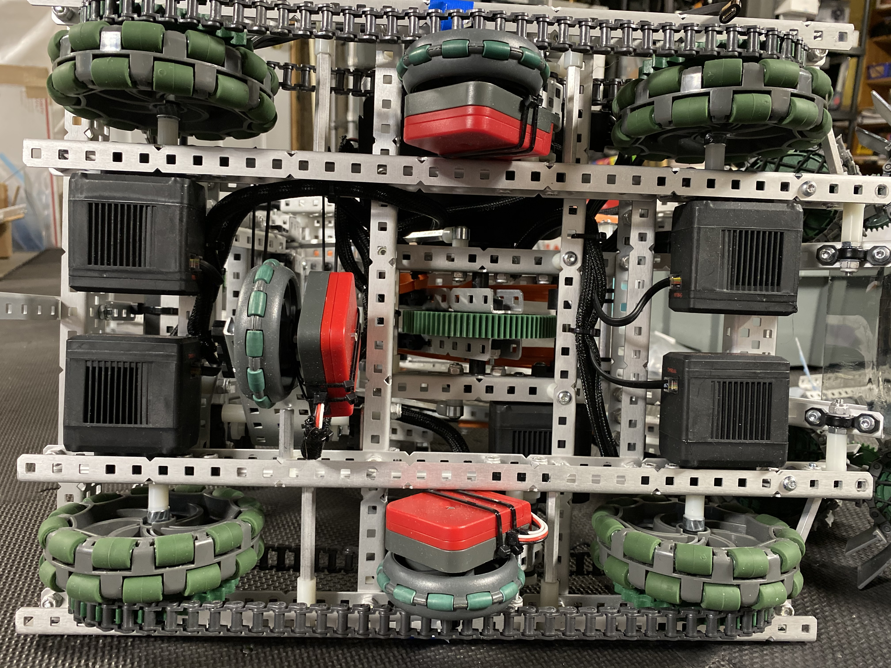
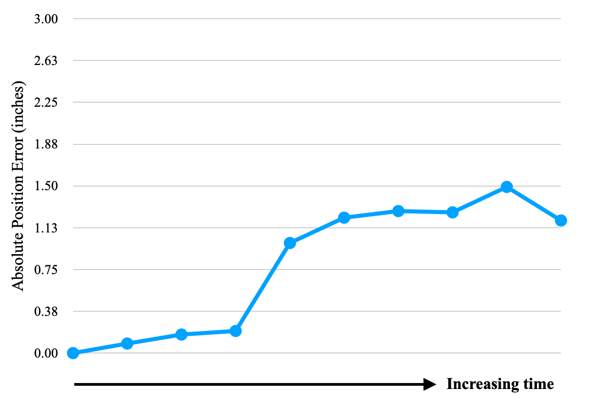
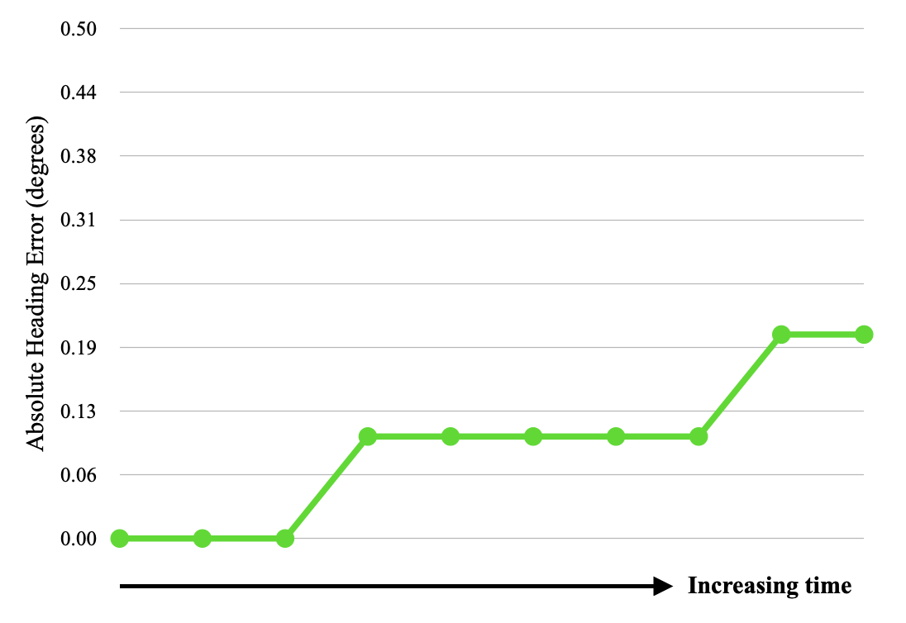

# Robust Localization

The VEX U Robotics competition sees robots compete autonomously for 45 to 120 second periods. To achieve a high level of play, it is essential to maintain an understanding of where the robot is located within the global coordinate frame.

To solve the problem of localization, a dead-reckoning system using multi-encoder odometry and an Inertial Measurement Unit (IMU) was developed. A triad of dedicated odometry wheels was installed on the robot. This unique mechanical design allows for high resolution odometry without the possibility of wheel slippage.

Our localization system proved highly robust and accurate. As can be seen in the plots below, the position and orientation error components accumulate very slowly over time and do not significantly impact the robot's performance over time. We are currently looking to supplement this system with LIDAR/Vision to provide the dead-reckoning system with periodic corrections. This will further improve the accuracy of the position and orientation estimates, and introduce further redundancy.

