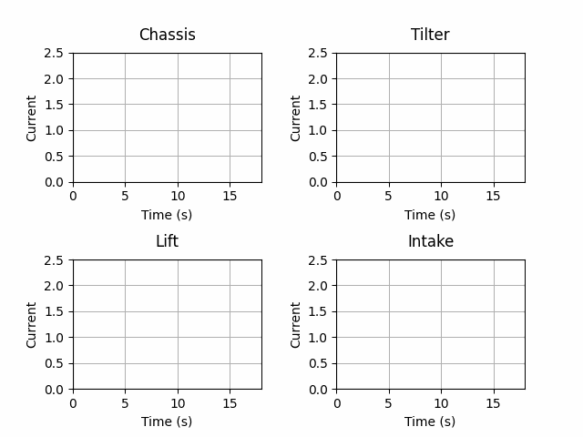

# Adaptive Power Management

One of the challenges of the VEX U Competition is using the standard VEX components while achieving higher functionality and performance.

For instance, the system is designed to output 20 amps continuously, yet most VEX U robots have maximum loads of 40+ amps. This calls for a unique solution, whereby a power manager accepts feedback from all subsystems about their state and current loading, and adjusts the current limits appropriately. This allows our robots to use significantly more motors without jeopardizing the performance of any one subsystem.

## With Power Management

In the animation below, the robot is using all four of its subsystems. The maximum motor current for each motor in the subsystem (where the maximum motor draw is 2.5A) is dynamically adjusted based on state, load and priority.

## Without Power Management

Without the power manager, the current limit for each motor is constant regardless of whether the motor is drawing current or not. The current limit is calculated by dividing the total current cap (20A) by the number of motors. In the high school competition, only 8 motors may be used, providing each motor with a 2.5A current limit. Our robots, however, use 16+ motors reducing the current limit to 1.25A per motor. This has a significant impact on performance. 

